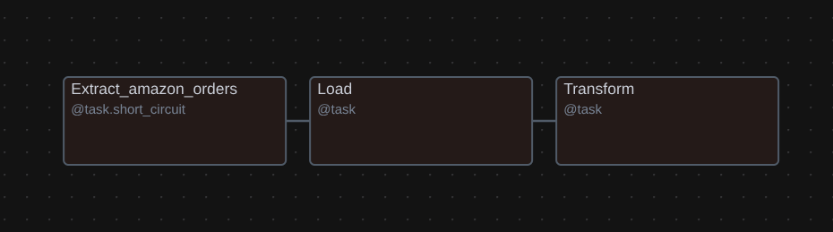
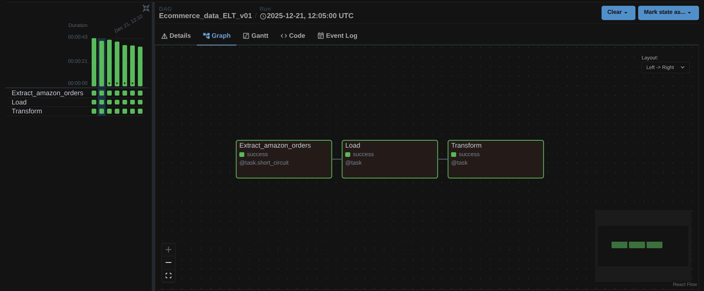
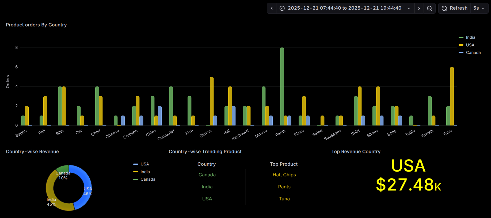

# 🛒 Amazon_Ecommerce_ELT

## 📘 Project Overview
**Amazon_Ecommerce_ELT** is a near real-time **metadata-driven ELT (Extract, Load, Transform)** data pipeline built for processing **Amazon e-commerce order data** from multiple regions (**USA, India, Canada**).

The pipeline automatically **extracts order data from REST APIs**, stores raw JSON files in an **S3-compatible data lake (MinIO)**, for historical tracking, transforms the data using **Apache Spark**, and finally loads the curated dataset into a **ClickHouse Data Warehouse** for analytical use cases.

The entire workflow is orchestrated using **Apache Airflow**, ensuring reliability, scheduling, and observability.


## 🗃️ Tech Stack
- **Apache Airflow** – Workflow orchestration and scheduling
- **Python** – API ingestion and orchestration logic
- **REST APIs** – Amazon order data source (USA, India, Canada)
- **Amazon S3 / MinIO** – Data lake for raw data
- **Apache Spark (PySpark)** – Data transformation and enrichment
- **ClickHouse** – Columnar data warehouse for analytics
- **JSON** – Raw data exchange format
- **YAML** – Metadata-driven configuration for regional settings


## 🏗️ Project Structure

    Amazon_Ecommerce_ELT/
    ├── API-requests.txt        --> Lists API endpoints
    ├── Ecommerce_ELT_dag.py    --> Airflow DAG defining the ELT workflow
    └── country_data_config/    --> Configuration files for each region
        ├── usa_config.yaml
        ├── india_config.yaml
        └── canada_config.yaml


## ⚙️ How the Project Works

### 1️⃣ Extract – API to S3
Implemented in `Extract_amazon_orders()`
- Uses **Airflow HttpHook** to fetch order data from REST API endpoints configured in **YAML files** (country_data_config/)
- Each region has its own configuration file specifying:
  - API endpoint
  - Data key for JSON extraction
  - S3 storage bucket and key naming
- Each API returns region-specific order data in JSON format.
- The extracted data is serialized and stored in an **S3 bucket (`amazon-orders`)** under:
  ```bash
  s3://amazon-orders/New-Orders/
      ├── usa_orders.json
      ├── india_orders.json
      └── canada_orders.json
  ```
- A **ShortCircuitOperator** ensures downstream tasks run **only if all API calls succeed**.

### 2️⃣ Load – New-Orders to Data Lake (Raw Zone)
Implemented in `Load()`
- Reads newly extracted JSON files from the **New-Orders** folder.
- Converts JSON data to **Parquet format** for better compression and query performance using **Pandas**.
- Stores the converted Parquet files into a **timestamped Raw Zone** as an immutable **historical archive**:
  ```bash
  s3://amazon-orders/Raw-Orders/
      └── orders_at_<execution_timestamp>/
          ├── usa_orders.parquet
          ├── india_orders.parquet
          └── canada_orders.parquet
  ```
- Enables **time-travel, reprocessing, and debugging** of historical data.

### 3️⃣ Transform – Spark to ClickHouse (Analytics Layer)
Implemented in `Transform()`
- Uses **Apache Spark (PySpark)** with **S3A connector** to read JSON files directly from the New-Orders folder in MinIO.
- Performs data cleaning and enrichment on each region's data:
  - Extracts `country` from delivery address (splitting by comma and trimming whitespace)
  - Converts price to numeric `price_dollar` (removing '$' symbol)
  - Casts ratings to integers
  - Builds a unified `timestamp` column from date and time columns
- Selects standardized analytical columns: `country, order-id, product, price_dollar, payment method, rating, comment, delivery address, timestamp`
- Merges transformed data from all regions into a **single unified DataFrame**.
- Loads the merged data into **ClickHouse** using JDBC in **append mode**:
  ```text
  Database : Amazon_Orders_DW
  Table    : orders
  ```


##  Airflow DAG Overview

**DAG Name :** `Ecommerce_data_ELT_v01`

**Schedule :** `*/5 * * * *` (Every 5 minutes)

**DAG Flow :** `Extract_amazon_orders → Load → Transform`

Ensures fresh data ingestion with minimal latency while preventing parallel DAG overlaps using `max_active_runs = 1`.


## 🖼️ Airflow DAG Image

### 🔹 DAG View :



### 🔹 Task Instance View for successful DAG runs :



## 📊 Dashboard

### 🔹 Grafana Dashboard (Refresh-rate: 5 secs)


