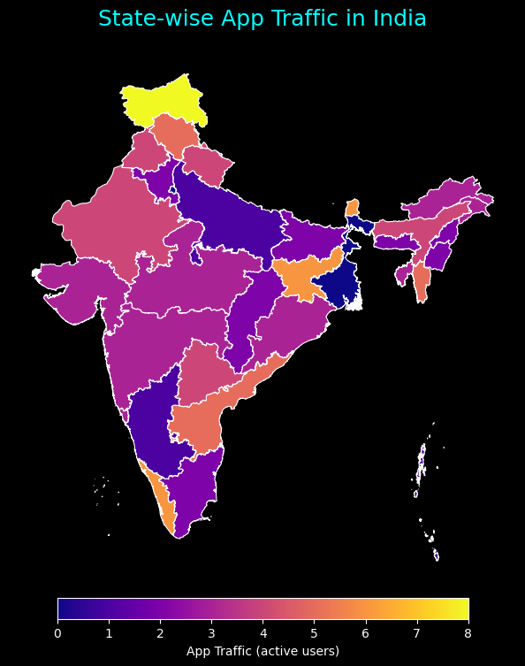

# 📱 App_Traffic_Monitor

## 📘 Project Overview
**App_Traffic_Monitor** is a real-time data engineering project that captures, processes, and visualizes live **mobile app usage traffic** across India.  

The system leverages **Apache Kafka** for event streaming, **Apache Spark Structured Streaming** for processing, and **Delta Lake** for transactional storage.  
It provides a continuously updated dataset of user interactions, devices, and locations — ready for real-time dashboards and analytics.

## 🗃️ Tech Stack

- **Apache Kafka** – Event ingestion and message queue
- **Apache Spark Structured Streaming** – Real-time event transformation
- **Delta Lake** – ACID-compliant data lake for streaming data
- **HTTP API (FakerAPI)** – Real-time data source
- **Folium / GeoJSON / Jupyter Notebook** – Traffic dashboard and state-wise map
- **Python** – Core programming logic

## 🏗️ Project Structure

        App_Traffic_Monitor/
        ├── App_Traffic_Delta/              --> Delta Lake storage (partitioned by user_id)
        │ ├── _delta_log/                   --> Delta transaction logs
        │ ├── user_id=*                     --> Parquet partitions for each user
        │ └── ...
        ├── Look_UP_Data/                   --> Static lookup data for devices & events
        │ ├── Devices.parquet
        │ ├── Events.parquet
        │ └── gadm41_IND_1.json             --> India state boundaries for visualization
        ├── metadata/                       --> Checkpoint directory for streaming jobs
        │ └── app_events_checkpoint/
        ├── Event_Logger.py                 --> Spark streaming job for processing Kafka data
        ├── Usage_Reporter.py               --> Kafka producer simulating real-time app usage
        ├── Updater.py                      --> Delta table updater for logout events
        ├── App_Traffic_Visualizer.ipynb    --> Jupyter Notebook for analysis & reporting
        └── India_app_traffic.html          --> Geo-visualization dashboard

## ⚙️ How the Project Works

### 1️⃣ Usage Reporter – **Kafka Producer**
**File:** `Usage_Reporter.py`

- Continuously generates **synthetic app usage events** using the **FakerAPI**.
- Each event includes: `user_id`, `state`, `event_id`, `device_id`
- Publishes events to the Kafka topic **`app-events`**.
- Simulates a diverse user base across multiple states and device types.

**Sample Event JSON:**

    {
      "user_id": 103,
      "state": "West Bengal",
      "event_id": 3,
      "device_id": 1
    }

### 2️⃣ Event Logger – **Spark Structured Streaming Job**
**File:** `Event_Logger.py`

- Reads incoming events from Kafka topic app-events in real time.
- Parses JSON payloads and applies preprocessing:
  - Cleans inconsistent state names.
  - Maps `event_id` and `device_id` to descriptive attributes using lookup tables.
- Joins with:
  - `Events.parquet` → Maps `event_id` to **event types** (e.g., “login”, “in_app_purchase”)
  - `Devices.parquet` → Maps `device_id` to **device types** (e.g., “Mobile”, “Computer”)
- When it detects terminal events such as `account_deleted` or `session_ended`, it removes corresponding user records from the Delta table using a merge operation.
- Writes streaming data to a Delta Lake table.

**Delta Table Path:**

    /home/victus/Fahad/Kafka/App_Traffic_Monitor/App_Traffic_Delta

### 4️⃣ App Traffic Visualizer – **Dashboard & Reporting**
**File:** `App_Traffic_Visualizer.ipynb`

- Reads Delta data incrementally to display live traffic statistics.
- Joins with `gadm41_IND_1.json` (India state shapefile) for geographical visualizations.
- Renders output to `India_app_traffic.html`, showing Regional traffic intensity.

## 🧩 System Architecture
**The system integrates Kafka, Spark, and Delta Lake for reliable, low-latency streaming analytics.**

    ┌───────────────────────────────┐
    │         Faker API             │
    │   (Synthetic Event Source)    │
    └──────────────┬────────────────┘
                   │
                   ▼
    ┌──────────────────────┐   Kafka Topic: 'app-events'   ┌──────────────────────────┐
    │   Usage_Reporter     │  ───────────────────────────▶ │      Event_Logger        │
    │  (Kafka Producer)    │                               │ (Spark Structured Stream)│
    └──────────────────────┘                               └──────────────────────────┘
                                                                         │
                                                                         ▼
                                                            ┌──────────────────────────┐
                                                            │      Delta Lake          │
                                                            │   App_Traffic_Delta/     │
                                                            └──────────────────────────┘
                                                                         │
                                                                         ▼
                                                           ┌──────────────────────────┐
                                                           │        Updater           │
                                                           │ (Delta Table Cleaner)    │
                                                           └──────────────────────────┘
                                                                         │
                                                                         ▼
                                                   ┌────────────────────────────────────────────┐
                                                   │ App_Traffic_Visualizer.ipynb / HTML Report │
                                                   │  (Geo Visualization & Analysis)            │
                                                   └────────────────────────────────────────────┘

## 🎯 Outcome

### 🔹 Visualization of user distribution across India

