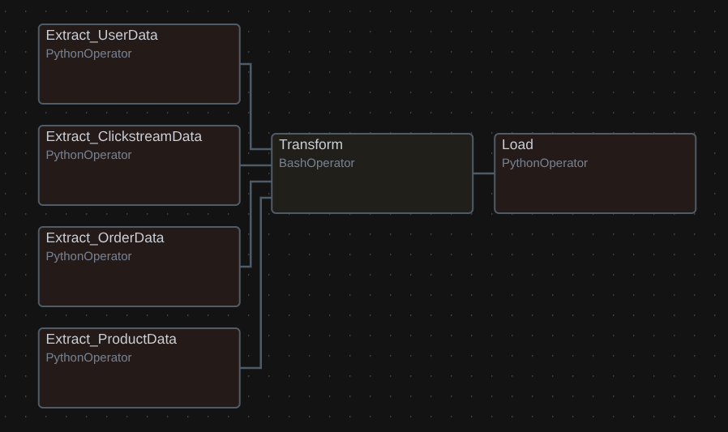
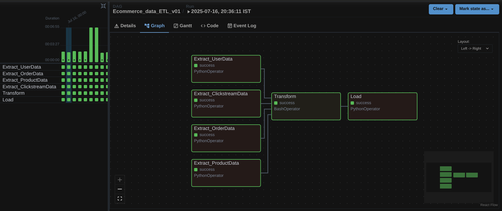
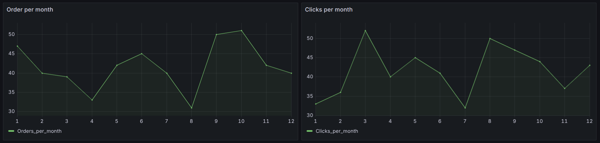
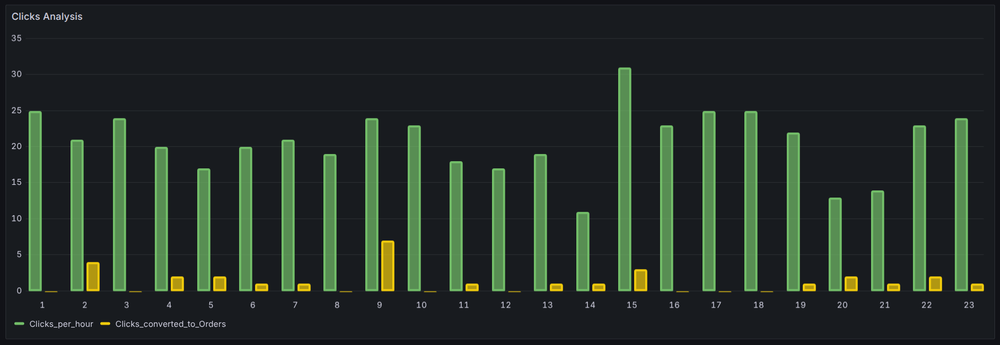

# 🛍️ Ecommerce_Project

## 📘 Project Overview
**Ecommerce_Project** is a real-time **ETL (Extract, Transform, Load)** pipeline designed for an **e-commerce data warehouse**.  
The system automates data ingestion from raw CSV files, synchronizes staging tables in **MySQL**, applies **dbt transformations**, and loads the processed data into a **ClickHouse-based Data Warehouse** for analytical querying.

This project leverages **Apache Airflow** for workflow orchestration and **Apache Spark** for distributed data processing and database operations.


## 🗃️ Tech Stack
- **Apache Airflow** – Orchestration and scheduling
- **Apache Spark (PySpark)** – Data extraction and loading
- **MySQL** – Staging area database
- **ClickHouse** – Data warehouse for analytics
- **dbt (Data Build Tool)** – Transformation and modeling
- **Python** – Scripting and automation
- **CSV (Real-time source)** – Raw data input files


## 🏗️ Project Structure

    Ecommerce_Project/
    ├── Data_Generator.py     --> Script for generating continuous real-time data
    ├── Ecommerce_ETL_dag.py  --> Airflow DAG defining the ETL workflow
    └── Real_time-Raw_data/   --> Raw incoming data directory
        ├── clickstream.csv
        ├── orders.csv
        ├── products.csv
        └── users.csv


## ⚙️ How the Project Works

### 1️⃣ Extract – Raw to Staging (MySQL)
Implemented in `Data_Extracter()`  
- The **Extract** step uses **PySpark** to read each CSV file (`users`, `products`, `orders`, `clickstream`) from the local `Real_time-Raw_data/` directory.  
- It compares the new raw dataset against the existing records in the **MySQL staging area** (`Ecommerce_DW_Staging_Area`) using a **set subtraction (`r_df.subtract(s_df)`)**.  
- Only new records are inserted into MySQL to avoid duplication.  
- If no new data exists, Airflow logs the message and skips writing.

### 2️⃣ Transform – dbt Transformation Layer
Implemented as a **BashOperator** calling `dbt run`  
- The transformation layer resides in a **separate dbt project** (`~/Fahad_dbt/Ecommerce_project_dbt`).  
- dbt models clean, join, and aggregate the staging data to create **analytical dimension and fact tables**.  
- Executed within a virtual environment via:
  ```bash
    source ~/Python-3/bin/activate && dbt run
### 3️⃣ Load – Staging to Data Warehouse (ClickHouse)
Implemented in `Data_Loder()`

After transformations, PySpark reads from MySQL staging tables (Tusers, Torders, Tproducts, Tclickstream).

Data is appended to corresponding ClickHouse tables:

    users       → dim_users
    products    → dim_products
    orders      → fact_orders
    clickstream → fact_clicks
Once loading completes, the pipeline triggers Data_Generator.py to simulate continuous data flow for the next ETL cycle.


##  Airflow DAG Overview

**DAG Name :** `Ecommerce_data_ETL_v01`

**Schedule :** `@daily`

**DAG Structure :**`[Extract_UserData, Extract_ProductData, Extract_ClickstreamData, Extract_OrderData] → Transform → Load`

Each Extract task runs in parallel for efficiency.
After extraction, dbt transformations and ClickHouse loads are executed sequentially.


## 🖼️ Airflow DAG Image

### 🔹 DAG View :



### 🔹 Task Instance View for successful DAG runs :



## 📊 Dashboard / Analysis

### 🔹 Order and Click Trend (monthly)


### 🔹 Clicks Analysis (hourly)
