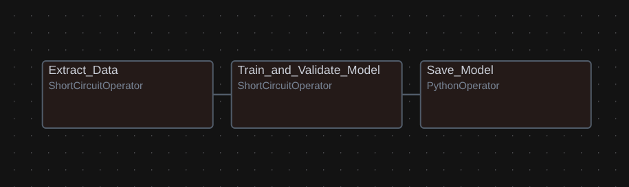
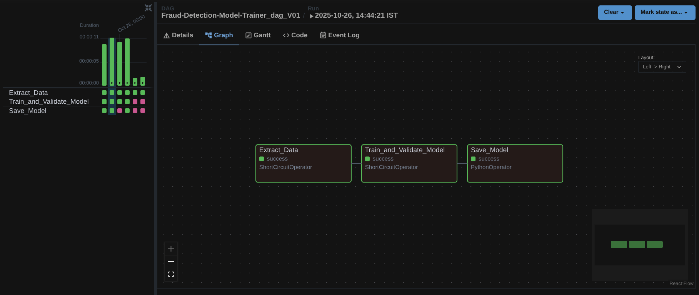
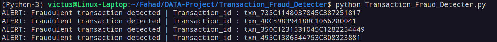

# 💳 Transaction_Fraud_Detecter

## 📘 Project Overview
**Transaction_Fraud_Detecter** is a real-time **financial fraud detection pipeline** designed to identify suspicious transactions using **machine learning** and **stream processing**.  

It combines **Apache Kafka** for streaming transactions, **Apache Airflow** for automated model training and orchestration, and **XGBoost** for predictive analytics.  
The system continuously retrains models based on new data, validates performance, and automatically promotes models that meet accuracy thresholds — ensuring reliable, up-to-date fraud detection.

## 🗃️ Tech Stack

- **Apache Kafka** – Real-time transaction streaming  
- **Apache Airflow** – Automated orchestration & retraining pipeline  
- **XGBoost** – Fraud detection model  
- **Scikit-learn** – Data preprocessing and encoding  
- **Pandas / Parquet** – Data handling and storage  
- **Joblib** – Model persistence  
- **Jira API** – Failure alerts and notifications  

## 🏗️ Project Structure

    Transaction_Fraud_Detecter/
    ├── Data/
    │ ├── Training_data/
    │ │ ├── Training_data_0.parquet
    │ │ ├── Training_data_1.parquet
    │ │ ├── Training_data_2.parquet
    │ │ └── Training_data_3.parquet
    │ └── transactions.parquet
    │
    ├── Metadata/
    │ └── Last_Trained_data.txt
    │
    ├── Model/
    │ ├── Final/
    │ │ ├── Model_Metrics.txt
    │ │ ├── onehot_encoder.pkl
    │ │ └── xgb_fraud_detection_model.pkl     --> Latest production-ready model
    │ └── Temp/
    │ ├── Model_Metrics.txt
    │ ├── onehot_encoder.pkl
    │ └── xgb_fraud_detection_model.pkl       --> Temporary model during training/validation
    │
    ├── Fraud_Detection_Model_Trainer_dag.py  --> Airflow DAG for automated retraining
    ├── Model_Trainer_Validater.py            --> Model training & validation script
    ├── Training_Data_Sensor_dag.py           --> Airflow DAG for detecting new training data
    ├── Training_data_extracter.py            --> Extracts new batches of data
    ├── Transaction_Fraud_Detecter.py         --> Real-time fraud detector (Kafka consumer)
    └── Transaction_Provider.py               --> Simulates transactions (Kafka producer)

## ⚙️ How the Project Works

### 1️⃣ Transaction Provider – **Kafka Producer**
**File:** `Transaction_Provider.py`

- Reads transaction data from `Data/transactions.parquet`  
- Publishes each transaction to Kafka topic **`financial-transactions`**
- Simulates a stream of user-to-user payments for fraud detection

### 2️⃣ Transaction Fraud Detecter – **Kafka Consumer**
**File:** `Transaction_Fraud_Detecter.py`

- Consumes messages from Kafka topic `financial-transactions`
- Uses the **latest trained XGBoost model** and **encoder** from `/Model/Final/`
- Predicts each transaction’s fraud probability in real time
- Prints alerts for fraudulent transactions

**Sample Output:**

    ALERT: Fraudulent transaction detected | Transaction_id : txn_124C123456789C987654321

### 3️⃣ Model Trainer & Validater – ML Engine
**File:** `Model_Trainer_Validater.py`

- Trains and validates a fraud detection model using `Training_data/*.parquet`
- Splits data into training/testing sets and encodes categorical features (`type`)
- Trains an **XGBoost Classifier** with class imbalance handling
- Evaluates using:
  - **ROC-AUC score**
  - **Classification report**
- Saves the model and encoder to `/Model/Temp/`
- Promotes model to `/Model/Final/` only if **AUC ≥ 0.95**

### 4️⃣ Training Data Sensor DAG – Data Detection & Signaling
**File:** `Training_Data_Sensor_dag.py`

Continuously **monitors the filesystem** for new training data and **triggers model retraining** when fresh data arrives.

- Uses an Airflow **FileSensor** to watch the training data directory
- Emits an Airflow **Dataset event** upon detecting new files
- Triggers the **Fraud Detection Model Trainer DAG** via dataset-based scheduling
- Decouples **data sensing** from **model training logic**

This DAG implements an **event-driven orchestration pattern**, commonly used in **production data platforms** to separate **data availability detection** from **compute-heavy processing**.

### 5️⃣ Fraud Detection Model Trainer DAG – Airflow Automation
**File:** `Fraud_Detection_Model_Trainer_dag.py`

Automates the **entire ML lifecycle**:

- Extracts **new batches of training data**
- Retrains and validates the model
- Promotes the model if performance is sufficient
- Sends **Jira alerts** on failures or low performance

**Airflow Tasks:**

| **Task ID**                | **Description**            | **Operator**         |
| -------------------------- | -------------------------- | -------------------- |
| `Extract_Data`             | Check for new data batches | ShortCircuitOperator |
| `Train_and_Validate_Model` | Train XGBoost model        | ShortCircuitOperator |
| `Save_Model`               | Promote to final model     | PythonOperator       |

## 🧩 System Architecture
**End-to-End Fraud Detection Pipeline**

    ┌──────────────────────────────┐                                  ┌──────────────────────────────┐
    │     Transaction Provider     │                                  │  Airflow DAG: Model Trainer  │   
    │       (Kafka Producer)       │                                  │     Automated Retraining     │
    └──────────────┬───────────────┘                                  │              +               │
                   │  Kafka Topic: 'financial-transactions'           │         Jira Alerts          │              
                   ▼                                                  └──────────────┬───────────────┘    
    ┌──────────────────────────────┐                                                 │     
    │  Transaction Fraud Detecter  │                                                 ▼   
    │  (Kafka Consumer + XGBoost)  │                                  ┌──────────────────────────────┐         
    └──────────────┬───────────────┘                                  │  Model Store (Temp / Final)  │      
                   │                                                  │      onehot_encoder.pkl      │    
                   ▼                                                  │ xgb_fraud_detection_model.pkl│ 
    ┌──────────────────────────────┐                                  └──────────────────────────────┘             
    │     Fraud Alerts (Console)   │                                              
    └──────────────────────────────┘                                                

##  Airflow DAG Overview

**DAG Name :** `Fraud-Detection-Model-Trainer_dag_V01`

**Schedule :** `Dataset-triggered`

**DAG Flow :** `Extract_Data → Train_and_Validate_Model → Save_Model`

Each task executes sequentially and is equipped with retry logic, logging, and a Jira-based failure callback for reliability.

## 🔗 Airflow Connection

- **`jira_connection`** → ***Jira API connection for notifications***

**Used for automatic issue creation in the Jira project FDMTP on task failure or low model performance.**

## 🖼️ Airflow DAG Image

### 🔹 DAG View :

### 🔹 Task Instance View for successful DAG runs :

## 🎯 Outcome

### 🔹 Active Fraud Detection :
